# Unified audio analysis

`tools/audio_analysis.py` is the single place for WAV decoding, signal
measurements, click detection, reference comparison, spectrograms, and
cart-aware SFX diagnosis.
Renderers and recorders produce WAV files; regression gates import this module
to judge them. Do not add a private WAV loader, pitch estimator, RMS helper, or
FFT metric to another tool unless the format or numerical contract is genuinely
different.

The public facade is deliberately one module and one command. Private
`_audio_analysis_policy.py`, `_audio_analysis_reporting.py`,
`_audio_analysis_terminal.py`, and `_audio_analysis_cli.py` modules separate
policy, presentation, terminal rendering, and command orchestration without
creating competing public tools.

The core command needs Python 3 and NumPy. Image spectrograms additionally need
Matplotlib; terminal spectrograms do not.

## Compare or inspect WAV files

Compare one or more candidates with a reference:

```sh
python3 tools/audio_analysis.py wav compare reference.wav candidate.wav
python3 tools/audio_analysis.py wav compare reference.wav hardware.wav preview.wav \
  --labels hardware,preview --verbose
python3 tools/audio_analysis.py wav compare reference.wav candidate.wav \
  --profile full-track-v1  # explicit legacy verdict without click gating
python3 tools/audio_analysis.py wav compare reference.wav candidate.wav \
  --view waveform --view pitch-delta --view spectral-diff --layout columns
```

Inspect one WAV with independent terminal views:

```sh
python3 tools/audio_analysis.py wav inspect render.wav \
  --view spectrogram --view clicks --layout columns
build/obj_dir/console --audio-wav - | \
  python3 tools/audio_analysis.py wav inspect - --view clicks
```

Compose comparison views, write a full-resolution spectrogram image, or limit
every requested view to one time range:

```sh
python3 tools/audio_analysis.py wav compare reference.wav candidate.wav \
  --view spectrogram --view metrics --view residual --layout columns \
  --view-range 12:16 \
  --spectrogram-file build/audio-comparison.png
```

The comparison deliberately reports independent properties:

| Measurement | Detects | Applicability |
| --- | --- | --- |
| pitch | wrong note, octave, or oscillator rate | pitched reference windows |
| level | missing voices and envelope/amplitude errors | live reference windows |
| spectrum | wrong harmonic shape at the right pitch and level | every window |
| band level | broad tilt and excess noise in quiet passages | active frequency bands |
| lock | sequencer drift after an initially correct start | pitched material |
| contour | wrong loudness or timbre trajectory | unpitched/noise material |
| clicks | isolated PCM discontinuities after periodic waveform-edge suppression | every input |

Pitched material is sample-aligned. Noise and percussion are aligned by their
smoothed power envelope because independent random realizations cannot have a
meaningful sample correlation. Spectrogram panels always share one dB scale;
normalizing each render independently would hide level defects.

### Versioned verdict profiles

`wav compare` defaults to `--profile full-track-v2`. It gates every applicable
measurement rather than treating spectrum, level, timing lock, and clicks as
decorative diagnostics:

| Gate | `full-track-v2` threshold |
| --- | ---: |
| pitch agreement or unpitched contour | at least 0.85 |
| median live-window RMS ratio | 0.75 through 1.33 |
| spectrum cosine median / p10 | at least 0.90 / 0.80 |
| absolute active-band difference | at most 1.5 dB |
| lock median correlation | at least 0.68 |
| blocks tracking one lag | at least 0.45 |
| candidate-only click events | 0; match reference events within +/-8 samples |

Lock is not applied to unpitched material or audio too short to produce a lock
block. The complete policy, including applicability thresholds and quiet-window
selection, is returned in JSON and stored in PSG track provenance manifests.
Threshold meaning is immutable within a profile ID: changing a verdict guard
requires a new profile name and schema/test fixtures, so cached agent decisions
cannot silently acquire new semantics.

`full-track-v1` preserves the previous full-track verdict: it reports click
analysis but does not gate it. `pitch-band-v1` is the older compatibility
profile: it gates pitch/contour and absolute bands while merely reporting level,
spectrum, lock, and clicks. Select either legacy profile explicitly; neither is
an implicit fallback.

The numeric `score` is only pitch agreement for pitched material or the weaker
of the two contour correlations for unpitched material. It is not the overall
verdict: `status` is `failed` when any applicable profile gate fails even if
`score` is at least 0.85. Agents should branch on `status` or process exit code,
then use `failure_types` to select the recovery path.

### Click detector defaults and limits

`click-v1` detects sparse amplitude discontinuities, not generic high-frequency
content. Its defaults are fixed and returned in every JSON result:

| Field | Default | Meaning |
| --- | ---: | --- |
| `minimum_delta_pcm` | 64 | absolute adjacent-sample jump on the signed 16-bit PCM scale |
| `minimum_severity_ratio` | 8.0 | jump divided by nearby derivative RMS |
| `context_radius_samples` | 64 | derivative context on each side (2.90 ms at 22,050 Hz) |
| `guard_radius_samples` | 2 | derivatives excluded on each side of the tested jump |
| `local_derivative_rms_floor_pcm` | 1.0 | denominator floor in signed 16-bit PCM units |
| `cluster_gap_samples` | 3 | nearby candidates collapsed into one event |
| `periodic_edge_similarity_ratio` | 0.5 | recurring edge must be at least half the event magnitude |
| `periodic_edge_max_gap_samples` | 551 | largest recurring-edge gap (24.99 ms at 22,050 Hz) |
| `periodic_edge_minimum_events` | 3 | similar close edges needed to classify a waveform train |
| `maximum_reported_events` | 32 | maximum event details in human or JSON output |
| `standalone_maximum_events` | 0 | `wav inspect` and `sfx analyze` verdict limit; comparison uses its own unmatched-event limit |

The detector first requires both the absolute jump and local severity guards.
It clusters the two sides of a one-sample impulse, then suppresses local trains
of at least three similar edges. That last step is essential: square, pulse, and
saw oscillators deliberately contain discontinuities and are not clicks merely
because their adjacent-sample delta is large. `candidate_edge_count` and
`suppressed_periodic_edge_count` make this classification auditable.

`wav inspect` and `sfx analyze` fail with exit 1 and `failure_types: ["clicks"]`
when any event remains. `wav compare` analyzes the already-aligned candidate on
the reference timebase. `full-track-v2` fails only candidate events which cannot
be matched to a reference event within 8 samples; a discontinuity already in the
reference is not attributed to the candidate. Event objects report
`sample_index`, `time_seconds`, signed `delta_pcm`, local derivative RMS, and the
severity ratio. Counts always cover every event; event detail arrays are capped
at 32 and carry an explicit truncation flag.

All decoded audio uses signed 16-bit amplitude units. Unsigned 8-bit WAV samples
are centered and multiplied by 256 at the input boundary, so click thresholds do
not silently become bit-depth dependent. Library callers passing arrays directly
must use the same scale and must pass the real `rate`; timestamps are computed
from that argument. The CLI still requires 22,050 Hz because its pitch, band,
alignment, and comparison policies are calibrated there.

This is a conservative discontinuity detector, not a perceptual proof. A click
below both thresholds or buried in already-high derivative energy can be missed,
and a defect which repeats like a short-period oscillator edge can be suppressed.
Use the returned timestamps with the clicks or spectrogram view when diagnosing
borderline audio. Changing any `click-v1` threshold requires a new click profile
ID; changing whether clicks affect comparison verdicts requires a new comparison
profile ID.

### Independent terminal views and composition

Terminal visualizations are independent rectangular panels. Repeat `--view` to
request several; flag order is panel order. `--layout rows` is the default and
prints each unchanged panel vertically. `--layout columns` places those same
panels side by side on one shared, newest-at-top time grid. A comparison
spectrogram expands to independent reference and candidate panels whose dB scale
is shared. Every panel has a dedicated horizontal plot-boundary row: the time
origin corner and x-axis never share a row with explanatory footer text.
Spectrogram and spectral-difference boundaries carry frequency ticks; other
views use a plain rule. Narrow panels omit colliding frequency labels instead of
truncating or overlapping them.
For `wav inspect`, the leading `view input: FILE` context line owns the input
label and panel titles contain only the view name. `wav compare` retains input
labels in panel titles because reference/candidate attribution is essential.

| View | `wav inspect` | `wav compare` | Content |
| --- | :---: | :---: | --- |
| `spectrogram` | yes | yes | log-frequency energy; shared dB scale for comparisons |
| `low-frequency-spectrum` | yes | yes | calibrated 1–250 Hz carrier energy on a fixed linear-frequency scale |
| `modulation-spectrum` | yes | yes | RMS-envelope modulation depth over 1–100 Hz; fixed scale |
| `pitch-track` | yes | yes | absolute voiced-pitch span per row on a fixed logarithmic frequency scale |
| `waveform` | yes | yes | min/max PCM envelope; comparison panels share one amplitude scale |
| `rms-level` | yes | yes | absolute RMS per displayed time row on a fixed dBFS scale |
| `rail-ratio` | yes | yes | exact full-scale sample occupancy per row on a fixed logarithmic scale |
| `peak-occupancy` | yes | yes | percentage of samples within 1% of each row's absolute peak |
| `quantization-step` | yes | yes | GCD of gaps between occupied non-rail integer PCM levels per row |
| `flatline-ratio` | yes | yes | exact adjacent-sample equality percentage per displayed time row |
| `block-repeat` | yes | yes | correlation of each displayed time block with its immediate predecessor |
| `crest-factor` | yes | yes | peak/RMS dynamics per displayed time row on a fixed dB scale |
| `derivative-ratio` | yes | yes | first-difference RMS relative to AC-signal RMS per time row |
| `spectral-change` | yes | yes | maximum normalized spectral-shape change per displayed time row |
| `spectral-centroid` | yes | yes | absolute DC-removed magnitude centroid per displayed time row |
| `spectral-flatness` | yes | yes | absolute tonal-to-broadband power-spectrum flatness per displayed time row |
| `sample-density` | yes | yes | time-local amplitude histograms on the fixed signed-16-bit PCM scale |
| `dc-offset` | yes | yes | signed mean PCM per time row; comparison panels share one dynamic scale |
| `stereo-balance` | yes | yes | original channel-2/channel-1 RMS balance; exposes one-channel loss |
| `stereo-level-diff` | yes | yes | channel-2-minus-channel-1 level over time and log frequency |
| `stereo-correlation` | yes | yes | original channel-1/channel-2 Pearson correlation; exposes anti-phase mono cancellation |
| `stereo-delay` | yes | yes | unique original-channel lag on a fixed signed millisecond scale |
| `stereo-phase` | yes | yes | wrapped channel-2-minus-channel-1 phase over time and log frequency |
| `stereo-coherence` | yes | yes | normalized channel cross-spectrum coherence over time and log frequency |
| `wave-correlation` | no | yes | signed mean-removed waveform correlation after alignment |
| `clicks` | yes | yes | event count and severity bars; comparison shows candidate-only events |
| `metrics` | no | yes | worst pitch, level, spectrum, and click state in each display row |
| `level-delta` | no | yes | signed per-window candidate/reference RMS error in dB |
| `pitch-delta` | no | yes | signed candidate-minus-reference tuning error for voiced windows |
| `timing-drift` | no | yes | half-second best-lag movement relative to the trusted modal lag |
| `contour` | no | yes | normalized loudness and timbre trajectory overlays for unpitched material |
| `band-delta` | no | yes | time-local and aggregate deviations in the four calibrated policy bands |
| `spectral-diff` | no | yes | signed candidate/reference dB difference over time and log frequency |
| `phase-diff` | no | yes | wrapped candidate-minus-reference phase over time and log frequency |
| `spectral-coherence` | no | yes | normalized reference/candidate cross-spectrum coherence over time and log frequency |
| `residual-ratio` | no | yes | aligned residual RMS relative to reference RMS on a fixed dB scale |
| `residual` | no | yes | min/max envelope of aligned candidate minus reference PCM |

`pitch-track` reuses the analyzer's non-overlapping 100 ms autocorrelation pitch
estimator. Only observations within 70 through 1200 Hz whose normalized
autocorrelation confidence is at least 0.30 are voiced; each displayed row spans
their minimum through maximum on a fixed log-frequency scale. Unvoiced or short
rows are blank, and `--view-range` reanchors the 100 ms windows at the selected
range start. The footer retains the voiced count, median note/frequency, and
observed range. This is not a pitch verdict: harmonic-heavy or polyphonic audio
can produce octave ambiguity, and noise can be unvoiced by design. In comparison
use `pitch-delta` for signed candidate/reference error and the structured status
for policy decisions.

`waveform` uses the maximum absolute sample in the selected range as its scale.
Comparison reference and candidate panels share that scale, so a quieter render
stays visibly narrower instead of being normalized to look correct. Each row is
the minimum-to-maximum PCM span with zero in the centre. `rail samples` counts
exact samples at -32768 or +32767; this surfaces likely saturation but is not by
itself a clipping verdict, because deliberately rail-limited source material is
possible.

`rms-level` plots `20*log10(RMS/32768)` for every displayed time row on a
fixed -96 through 0 dBFS scale. Left is quieter and right louder; values at or
below -96 dBFS stop at `<`, while exact digital silence is retained as `-inf`
in the footer rather than being misreported as the display floor. Reference and
candidate use independent panels but the same absolute scale, so this works for
single-WAV dropout/fade inspection as well as comparison. It is neutral
diagnostic presentation, not the profile's live-window level verdict, and its
row summaries change with the explicit time geometry.

`rail-ratio` is `100*count(sample<=-32768 or sample>=32767)/N` for each
displayed time row. Its fixed logarithmic scale runs from 1 ppm (`0.0001%`) to
100%, so a single isolated full-scale sample remains distinct from sustained
rail occupancy; zero is a separate `•` at the left and values at or below 1 ppm
stop at `<`. Any positive row is red for visibility, while the footer retains
exact selected counts and percentages. Red is diagnostic, not a clipping
verdict: deliberately rail-limited PCM can be valid, and a limiter can clip at
any level below full scale without appearing here. Compose this with
`waveform`, `sample-density`, `flatline-ratio`, and `crest-factor` before
diagnosing clipping. Empty rows are blank, and row ratios depend on the explicit
time geometry.

`peak-occupancy` is `100*count(abs(sample) >= 0.99*row_peak)/N` for each
displayed time row. Its fixed 0 through 100% scale moves right as more samples
cluster near that row's own positive or negative peak, exposing flat-topping at
levels below the signed-16-bit rails even when dither prevents exact repeated
samples. Silence and rows shorter than two samples are blank; the footer retains
row median/max plus whole-range peak and occupancy. Whole-range occupancy is
recomputed against the whole-range peak; it is not an average of the displayed
row values. The row-local threshold is intentionally amplitude-independent but
geometry-dependent. This is not a
clipping verdict: sine waves have nonzero natural peak occupancy, while square,
pulse, constant, and deliberately limited signals can legitimately reach 100%.
Compose it with `waveform`, `crest-factor`, `flatline-ratio`, and `rail-ratio`
before diagnosing clipping.

`quantization-step` sorts the occupied decoded integer PCM levels in each row,
excludes the exact signed-16-bit rails, and plots the greatest common divisor
of the remaining adjacent level gaps. The fixed log2 scale runs from a 1 PCM
step at the left to 32768 PCM at the right; rows with fewer than two distinct
interior levels are blank, larger steps stop at the right edge, and exact
row/selected steps remain in the footer.
A coarse lattice can expose bit crushing even when level and spectrum remain
plausible, but this is not a bit-depth oracle: dither or noise can reduce the
GCD to 1 PCM, while square waves, wavetables, and stepped synthesis can be
coarse intentionally. Rails are excluded so clipping endpoints do not collapse
the estimator; use `rail-ratio` beside it. The view is neutral diagnostic
presentation and never changes a verdict.

`flatline-ratio` is `100*count(diff(samples)==0)/(N-1)` within each displayed
time row. Its neutral fixed 0 through 100% scale moves right as more adjacent
decoded PCM samples repeat exactly; a fully held or silent row reaches the right
edge, and rows shorter than two samples are blank. Footer summaries retain exact
percentages over the rows and selected range. This is not a freeze verdict:
low-bit-depth quantization and square/pulse plateaus can legitimately repeat
many values, so compare against the reference or compose with `waveform` and
`sample-density`. Row-boundary pairs are omitted from row values but included
in the selected-range summary.

`block-repeat` computes mean-removed Pearson correlation between each displayed
time row and its immediate chronological predecessor. The fixed -1 through +1
scale places an identical waveform shape at the right edge, unrelated blocks
near the centre, and an inverted repeat at the left edge. The first
chronological row and constant/flat rows are blank. This is deliberately a
geometry-controlled comparison, not a search over every possible buffer size:
`--lines-per-second` determines the tested block duration, and partial or
misaligned repeats can be missed. Repeated rhythms and periodic waveforms can
also reach the right naturally, so compare the candidate with the reference.
The panel is diagnostic, uses neutral colour, and never changes a verdict.

`crest-factor` plots `20*log10(peak/RMS)` for each displayed time row. The
horizontal scale is fixed from 0 through 24 dB; values at or above 24 dB stop at
the right edge, silence is blank, and the footer retains exact row median/max
and selected-range values. A square or constant signal can legitimately sit at
0 dB, a sine is about 3 dB, and sparse impulses move right. Consequently the
panel uses neutral colour and has no good/bad threshold or verdict effect. Row
values depend on `--lines-per-second` and `--max-lines`, because changing the
time bucket changes which peak and RMS are summarized.

`derivative-ratio` plots `20*log10(RMS(diff(samples))/RMS(samples-mean))`
for each displayed row. The fixed -48 through +6 dB scale runs from smoother
left to rougher right; out-of-range values stop at an edge, and constant or
silent rows are blank. The footer prints exact row median/max and selected-range
values. This is a cheap high-frequency/edge-energy proxy, not psychoacoustic
roughness and not a verdict: square, pulse, saw, noise, or deliberately bright
material can legitimately sit rightward. Its value also depends on sample rate,
waveform, and the chosen time-row geometry; pair it with `spectral-diff` to see
which frequencies changed.

`spectral-change` computes `1-cosine_similarity` between consecutive magnitude
spectra, then plots the maximum observation in each displayed row. Frames are
exactly 1024 samples with a Hann window and 512-sample hop; observations are
assigned at the midpoint between adjacent frame centres. DC is removed and
each magnitude spectrum is normalized before comparison, so a gain-only change
is deliberately suppressed. The fixed 0 through 1 scale means identical shape
at the left and disjoint shape at the right. A silent/non-silent transition is
1, two silent frames are blank, and a selected range too short to contain a
frame pair is blank. This is a transient/timbre-change diagnostic, not a verdict:
musical onsets and intended effect changes can move right, while slow spectral
drift can remain left. Use `spectral-diff` to see which frequencies changed and
`clicks` to distinguish isolated sample discontinuities.

`spectral-centroid` uses the analyzer's DC-removed magnitude-weighted centroid
in non-overlapping 100 ms windows. Each row spans its minimum through maximum
on a fixed log-frequency scale from 55 Hz to the 11025 Hz Nyquist limit; flat or
short rows are blank, and `--view-range` reanchors windows at the selected range
start. The footer retains active-window count, median, and exact observed range.
This is an absolute brightness proxy, not a verdict or perceptual model:
harmonic-rich, noisy, or intentionally bright sources can sit rightward, and
the same centroid can describe different spectra. Pair it with
`spectral-change` for transition timing and `spectral-diff` for frequency-local
explanation.

`spectral-flatness` is power-spectrum Wiener entropy over 55 Hz through 8 kHz
in non-overlapping 100 ms Hann windows. It approaches 0 when energy is
concentrated in tones and 1 when power is evenly spread across the band. Each
row spans its minimum through maximum on the fixed 0 through 1 scale; silent,
constant, and short rows are blank, and `--view-range` reanchors the windows at
the selected range start. The footer retains the active-window count, median,
and exact range. This is a signal-character diagnostic, not a noise verdict:
percussion, unpitched synthesis, and intentional noise can sit rightward, while
narrow-band interference can remain tonal. Compare against a reference and use
`spectral-diff` to identify which frequencies changed.

`modulation-spectrum` analyzes periodic changes in loudness rather than carrier
frequency. It derives an RMS envelope in fixed 110-sample windows (about 5 ms)
at a 55-sample hop (about 2.5 ms), giving an envelope sample rate of exactly
400.909091 Hz at the required 22,050 Hz WAV rate. Each modulation observation
uses a 512-envelope-sample Hann FFT at a 256-sample hop: 1.277098 seconds per
FFT, 0.638549 seconds between FFTs, and 0.783025 Hz bins. Sinusoidal envelope
magnitude is divided by that frame's local mean RMS, so the vertical colour
scale reports modulation depth from a fixed -60 through 0 dB instead of
renormalizing each WAV. Frequency runs logarithmically from 1 through 100 Hz;
the axis marks 1, 5, 20, and 50 Hz. Silence, unsupported edge time, and depth at
or below -60 dB remain at the floor, while a range shorter than 512 envelope
samples is explicitly too short.

This view can identify rates associated with mains hum, tremolo, compressor
pumping, or flutter, but it does not determine their cause. Natural beating,
intentional tremolo, rhythmic pumping, and amplitude envelopes can produce the
same structures. It is an RMS-envelope diagnostic, not carrier-frequency
analysis, a standards flutter meter, or a verdict; structured JSON, quiet
output, status, and exit code remain unchanged. Compare reference and candidate
panels on the same fixed scale and use `spectrogram` to inspect carrier-side
energy around a suspected modulation.

`low-frequency-spectrum` analyzes carrier energy below the normal
spectrogram's useful range. Each observation uses a 16,384-sample Hann FFT at
an 8,192-sample hop: 0.743039 seconds per FFT, 0.371519 seconds between FFTs,
and 1.345825 Hz bins at 22,050 Hz. Per-frame DC is removed, Hann coherent gain
is corrected, and amplitude is divided by signed-16-bit full scale. The colour
scale is therefore fixed from -96 through 0 dBFS rather than normalized to the
loudest WAV. Frequency is linear from 1 through 250 Hz so 50 and 60 Hz mains
components and their harmonics stay spatially separable. Overlapping FFT frames
are mean-aggregated into each requested time cell; unsupported edge time and
energy at or below -96 dBFS remain at the floor. A selected range shorter than
16,384 samples is explicitly too short.

This is complementary to three other views: `dc-offset` reports literal sample
bias, `spectrogram` covers 55 Hz through 8 kHz with much shorter 1,024-sample
FFTs, and `modulation-spectrum` reports envelope rate rather than carrier
frequency. A 50 Hz line here means 50 Hz audio energy, not 50 Hz loudness
modulation. Mains hum, turntable rumble, HVAC vibration, sub-bass, and intended
musical bass can occupy the same region, so the panel is diagnostic rather than
a fault verdict and never changes JSON, quiet output, status, or exit code.

`sample-density` is an amplitude histogram for every displayed time row. Its
horizontal scale is always -32768 through +32767 PCM rather than the selected
peak, so rail sticking, silence at zero, asymmetric distributions, and coarse
quantization remain comparable between invocations. Density is square-root
compressed and normalized within each row: cyan glyph weight is relative
occupancy, not absolute loudness, and an exact signed-16-bit rail sample makes
the corresponding edge red. The footer retains exact selected-range mean and
rail counts. This is diagnostic presentation and never changes a verdict.

`dc-offset` plots the arithmetic sample mean in each time row. Reference and
candidate panels share the largest absolute row mean, with a minimum dynamic
scale of +/-256 PCM so harmless rounding noise does not fill the panel. Right
is positive, left negative; red marks `|mean| >= 256 PCM` as an explicit visual
diagnostic threshold, not a pass/fail policy. The footer prints the exact mean
over the selected range. A slowly moving trace can also represent sub-row-rate
content, so inspect the waveform or spectrum before calling it literal DC.

`stereo-balance` reads retained original channels 1 and 2 and plots
`20*log10(RMS(channel 2)/RMS(channel 1))` per time row. The fixed -24 through
+24 dB scale puts equal channel levels at the centre, channel 1 louder on the
left, and channel 2 louder on the right. A one-sided silent row pins red to the
corresponding edge; both-silent rows are blank. Mono is explicitly not
applicable, and inputs with more than two channels use only channels 1 and 2.
The panel diagnoses channel balance, not intended pan position, and never
changes a verdict.

`stereo-correlation` also reads the retained original channel layout instead of
the mono analysis signal. It plots mean-removed Pearson
correlation between decoded channels 1 and 2 in each time row on a fixed -1
through +1 scale: +1 is in phase and mono-compatible, 0 is decorrelated, and -1
is anti-phase and cancels under averaging. Flat channel rows are blank. Mono is
reported explicitly as `not applicable: mono`; inputs with more than two
channels explicitly use only channels 1 and 2. The view is diagnostic only.
Decoded channels are presentation context: every metric, verdict, JSON field,
quiet result, and exit status retains the documented mono-downmix behavior.

`stereo-delay` searches decoded channels 1 and 2 for the strongest absolute
Pearson correlation over a fixed -5 through +5 ms range. Positive means channel
2 occurs later; negative means channel 1 occurs later. A row is drawn only when
the strongest peak is at least 0.50 and exceeds every other local peak by at
least 0.05. That second condition deliberately blanks periodic signals whose
repeated cycles make several delays equally plausible. Flat, short, and other
ambiguous rows are also blank. A red point at an edge means the best observation
reached the search limit, so the true delay may be outside it. Mono is explicitly
not applicable; inputs with more than two channels use only channels 1 and 2.
This is a bounded diagnostic explanation for comb filtering, not a timing
verdict, and it never changes mono analysis or machine output.

`wave-correlation` is the mean-removed Pearson correlation between the aligned
reference and candidate samples in each time row. Its scale is fixed: +1 means
the same waveform shape, 0 means no linear sample relationship, and -1 means a
polarity inversion. Green is at least 0.95, yellow at least 0.70, and red below;
these are presentation thresholds, not verdict guards. Flat rows are blank and
the selected-range correlation is printed in the footer. Use this view only
when sample correspondence is meaningful: independently randomized noise may
correctly sit near zero, and a small phase or timing error can reduce correlation
without changing perceived sound. It never changes comparison JSON or status.

`metrics` is a diagnostic screening view, not a second verdict engine. `P`, `L`,
`S`, and `C` mean pitch, live-window RMS ratio, spectral cosine, and unmatched
clicks. Its glyphs are `·` good, `o` warning, `O` bad, `X` beyond a profile
guard, and `-` not applicable. Several 0.1-second analysis windows may collapse
into one terminal row; the worst visible state is retained. Always branch on the
top-level `status` and `failure_types`, not a glyph.

The metric levels are intentionally explicit heuristics over individual
windows: `P` is `X` for any pitch mismatch; `L` warns outside a 0.90..1.10 RMS
ratio and is `X` outside the profile's level bounds; `S` warns below 0.98, is
`O` below the profile median floor, and `X` below its p10 floor; `C` is the
number of unmatched events in that row (`+` means at least 10). The level and
spectrum profile guards apply to aggregate percentiles for the real verdict,
so one `X` glyph need not imply a failed result. This is why agents must use the
structured verdict for control flow.

`level-delta` plots `20*log10(candidate RMS/reference RMS)` for live reference
windows. Right is louder, left is quieter, and blank means the reference is
below the profile's live threshold. Its dynamic scale has a minimum of +/-3 dB;
candidate RMS is floored at 1 PCM so a dropout remains finite and visible. `!`
marks a window outside the profile's level bounds, but the real level verdict
applies those bounds to the aggregate median rather than every window.

`pitch-delta` plots `12*log2(candidate/reference)` for applicable voiced
analysis windows. Right is sharp, left is flat, and blank is not applicable.
Its dynamic scale is the largest absolute error in the selected range with a
minimum of +/-1 semitone; the profile tolerance is printed independently. A
range spanning both sides of zero immediately surfaces vibrato, unstable tuning,
or a pitch transition in the wrong direction.

`timing-drift` uses the same half-second best-lag observations as the lock gate.
It subtracts the trusted modal lag, removing a harmless constant recording
offset: right is progressively later and left is earlier. `!` marks a block
whose correlation is at or below the profile floor or whose lag is more than
the profile tolerance from the mode. The dynamic scale has a minimum of +/-1 ms.
If no strong modal lag exists, the panel uses the visual median as an explicitly
untrusted base and marks every observation; unpitched or short audio is blank.
The actual verdict still gates aggregate median correlation and tracked ratio.

`contour` is the unpitched counterpart to pitch and timing views. It expands to
independent loudness and timbre panels, z-normalizing each reference/candidate
trajectory over the selected range. `R` is the reference, `C` the candidate,
and a green `◆` means both quantize to the same display cell; left/right mean
below/above that signal's own selected-range mean. Independent normalization is
intentional because the contour verdict measures trajectory correlation rather
than absolute level or centroid offset. The +/-3 sigma display is clipped, and
each footer prints the corresponding full-track correlation used by the
verdict. Pitched material and ranges shorter than four analysis windows are
blank with an explicit reason.

`band-delta` maps the policy's four calibrated bands as `B` (55–250 Hz), `M`
(250 Hz–1 kHz), `H` (1–4 kHz), and `U` (4–8 kHz). Per-row `<`/`>` glyphs mean
the worst overlapping local observation is beyond the printed guard on the
missing/excess side; `,`/`.` are smaller signed differences inside the guard,
`·` is within 0.5 dB, and `-` is inactive. `q` marks rows participating in the
reference-selected quiet set. Local glyphs are diagnostic only: footer rows
print each band's whole-track (`W`) and quiet-median (`Q`) dB aggregates, which
are the scopes that can actually produce `band_level` failure.

`spectral-diff` subtracts the reference dB grid from the candidate after both
are clipped to the same spectrogram floor. `<` means missing candidate energy
and `>` means excess; intermediate glyphs show increasing magnitude. Cells
within 3 dB are blank, full glyphs begin at 24 dB, and the actual shared floor
is printed. It is a diagnostic view, not a separate spectral verdict: the
profile still gates its windowed cosine and absolute-band measurements.

The click view prefixes each occupied row with its event count and sizes the bar
from the maximum event severity in that row. A full bar means 64x local
derivative RMS or higher; values above 64x are clamped visually but remain exact
in JSON. Every visualization block starts with an untruncated input/comparison
context line, and every panel title includes its input or candidate label as
space permits. Composed batch diagnostics therefore remain attributable even
outside human report text or when a narrow panel truncates its title.

`residual-ratio` is
`20*log10(RMS(candidate-reference)/RMS(reference))` after comparison alignment.
Its fixed -60 through +6 dB scale makes error severity comparable between rows,
WAVs, and invocations: 0 dB means residual and reference have equal RMS, values
at or below -60 dB stop at `<`, and exact identity is retained as `-inf` in the
footer. Reference-silent and short rows are blank because a relative ratio is
undefined. This is sample-domain diagnostic presentation, not a perceptual
metric or verdict: polarity inversion, phase rotation, or a tiny timing error
can produce a large ratio despite similar sound. Use `residual` for waveform
shape, `wave-correlation` for signed shape agreement, and the structured status
for policy decisions.

`residual` uses the maximum absolute residual in the selected range as its
explicit horizontal `+/-PCM` scale. Each row shows the minimum-to-maximum span,
with zero at the center. A narrow mark means close sample agreement; a wide span
immediately exposes a click, phase discontinuity, or other localized mismatch.

#### Coloured terminal examples

These are captures of the real CLI with `--color always`; structured JSON stayed
on stdout while the captured views came from stderr. The source WAVs are local
PSG fidelity/oracle artifacts from the current worktree. The amplitude-health
example reproducibly injects quantization, DC bias, and clipping into one such
render so each encoding is visible; it is generated data, not a verdict fixture.

The shared-scale spectrograms retain the familiar absolute comparison, while
the signed difference panel immediately separates missing blue energy from
excess red energy:

```sh
python3 tools/audio_analysis.py --output json wav compare \
  build/psg_fidelity/noise-sweep-head.wav \
  build/psg_fidelity/noise-sweep-rtl.wav --labels rtl \
  --view spectrogram --view spectral-diff --layout columns \
  --view-width 32 --lines-per-second 1 --max-lines 10 \
  --axis first --color always
```

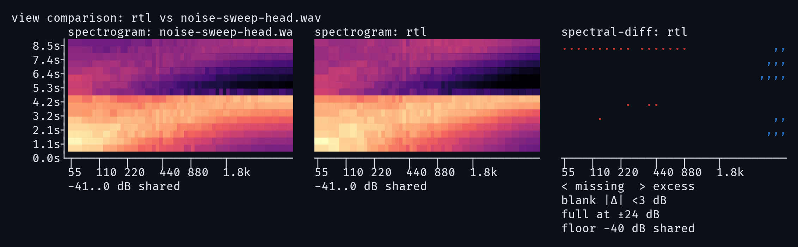

Magnitude can remain correct while phase is wrong. The deterministic example
below contains 344.531 Hz and 2756.250 Hz tones. After a 100 ms raised-cosine
transition at four seconds, only the upper tone in the candidate leads by 90
degrees. RMS stays matched and `spectral-diff` is blank throughout the sustained
fault; the dominant low tone keeps `wave-correlation` near +1, while
`phase-diff` localizes the otherwise-subtle error to the upper tone:

```sh
python3 tools/audio_analysis.py --output json wav compare \
  build/audio-analysis-docs/phase-reference.wav \
  build/audio-analysis-docs/phase-shift.wav --labels high-tone+90deg \
  --view wave-correlation --view spectral-diff --view phase-diff \
  --layout columns --view-width 24 --lines-per-second 1 --max-lines 10 \
  --axis first --color always
```

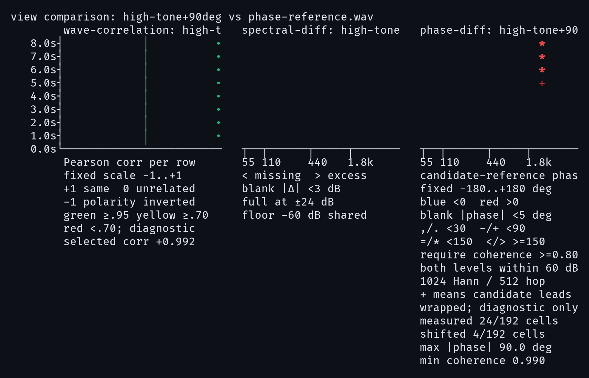

`phase-diff` is comparison-only and operates after the analyzer's ordinary
sample alignment. It aggregates normalized cross-spectra from 1024-sample Hann
FFTs at a 512-sample hop into the displayed time and logarithmic-frequency
cells. The scale is always wrapped -180..+180 degrees: blue/negative means the
candidate lags and red/positive means it leads. Cells stay blank when
`|phase| < 5` degrees, coherence is below 0.80, or either input is more than 60
dB below the shared cell-power peak. These masks avoid presenting arbitrary
phase from silence, weak leakage, or internally inconsistent energy as a fact.
Wrapping means a trace crossing +180 reappears at -180; this is a diagnostic
view, not an unwrapped group-delay estimate, policy gate, or JSON field.

Stable level and nearly perfect whole-wave correlation can also hide phase that
varies inside a time/frequency cell. The next deterministic mono comparison
keeps its dominant 344.531 Hz tone coherent, then phase-modulates only the quiet
2756.250 Hz tone at 10 Hz with modulation index 2.404826 after four seconds.
Full-track and affected-half waveform correlation remain +0.992308 and
+0.984616. `spectral-diff` stays blank because level is preserved, while
`phase-diff` stays blank because the affected cells fall below its 0.80
coherence requirement. `spectral-coherence` exposes those cells directly:

```sh
python3 tools/audio_analysis.py --output json wav compare \
  build/audio-analysis-docs/coherence-reference.wav \
  build/audio-analysis-docs/coherence-phase-modulated.wav \
  --labels fm \
  --view wave-correlation --view spectral-diff --view phase-diff \
  --view spectral-coherence --layout columns --view-width 24 \
  --lines-per-second 1 --max-lines 10 --axis first --color always
```

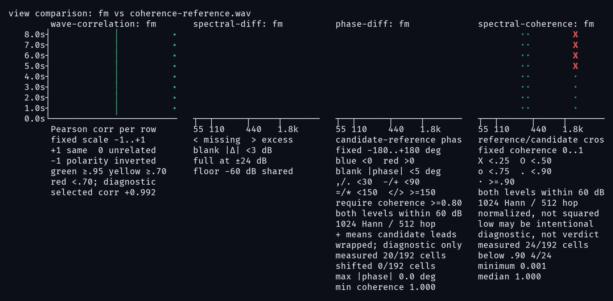

`spectral-coherence` is comparison-only and operates after ordinary sample
alignment. It uses the same 1024-sample Hann FFT, 512-sample hop, 55–8000 Hz
log-frequency cells, and shared -60 dB power floor as `phase-diff`. Its fixed
0..1 glyph scale is `X` below 0.25, `O` below 0.50, `o` below 0.75, `.` below
0.90, and a dim dot at or above 0.90. The value is normalized complex
cross-spectrum magnitude, not magnitude-squared coherence. Silence and cells
where either input falls below the shared floor are blank; ranges shorter than
1024 samples say they are too short. Low coherence can be intentional
modulation, randomized noise, or processing, so this remains a diagnostic view,
not a verdict, JSON field, or reason to fail a command by itself.

A deterministic tone sequence makes absolute pitch continuity and an unvoiced
gap immediately visible without parsing a spectrogram: 220 Hz rises to 440 Hz,
two seconds of silence stay blank, and 880 Hz resumes at the top. The RMS panel
separates the unvoiced gap from estimator uncertainty:

```sh
python3 tools/audio_analysis.py --output json wav inspect \
  build/audio-analysis-docs/pitch-steps.wav \
  --view spectrogram --view pitch-track --view rms-level --layout columns \
  --view-width 24 --lines-per-second 1 --max-lines 10 \
  --axis first --color always
```

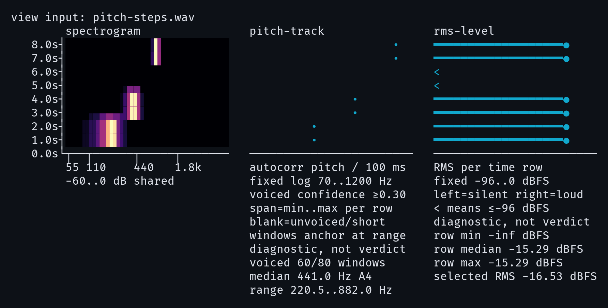

For independently generated noise, the contour panels are a more faithful shape
comparison than samplewise residuals. Matching trajectory positions collapse to
green diamonds; separated blue `R` and red `C` markers localize divergence:

```sh
python3 tools/audio_analysis.py --output json wav compare \
  build/psg_fidelity/noise-sweep-head.wav \
  build/psg_fidelity/noise-sweep-rtl.wav --labels rtl \
  --view metrics --view contour --layout columns \
  --view-width 24 --lines-per-second 1 --max-lines 10 \
  --axis first --color always
```

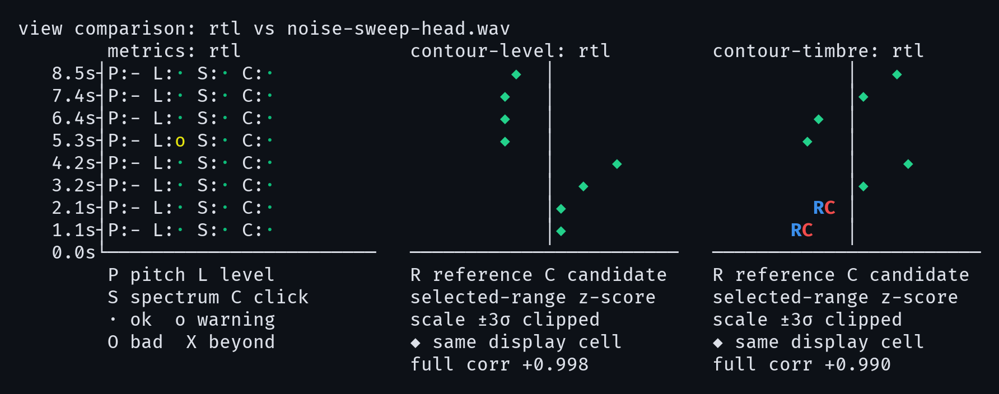

The calibrated band view turns the same failure into an agent-readable policy
explanation: quiet-row `U<` marks missing upper-band energy and the footer gives
the exact whole/quiet aggregates:

```sh
python3 tools/audio_analysis.py --output json wav compare \
  build/psg_fidelity/noise-sweep-head.wav \
  build/psg_fidelity/noise-sweep-rtl.wav --labels rtl \
  --view metrics --view band-delta --view spectral-diff --layout columns \
  --view-width 24 --lines-per-second 1 --max-lines 10 \
  --axis first --color always
```

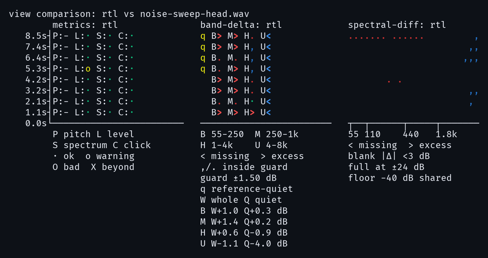

Candidate-only clicks line up across the waveform, click, and residual panels:

```sh
python3 tools/audio_analysis.py --output json wav compare \
  build/psg_fidelity/noise-sweep-head.wav \
  build/psg_fidelity/noise-sweep-rtl.wav --labels rtl \
  --view waveform --view clicks --view residual --layout columns \
  --view-width 24 --lines-per-second 1 --max-lines 10 \
  --axis first --color always
```

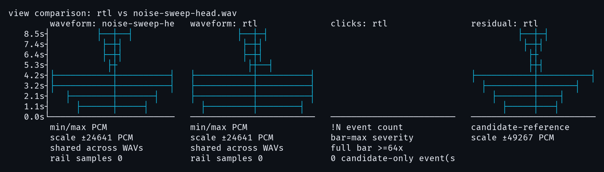

Amplitude-domain faults need no image dashboard. In this staged inspection the
top quarter is hard-clipped, the next carries positive DC, the next is coarsely
quantized, and the bottom quarter is unchanged. The waveform exposes extrema,
rail-ratio distinguishes sparse from sustained full-scale occupancy,
quantization-step measures the coarse integer lattice, sample-density exposes
discrete amplitude occupancy, and dc-offset localizes the signed bias:

```sh
python3 tools/audio_analysis.py --output json wav inspect \
  build/audio-analysis-docs/amplitude-artifacts.wav \
  --view waveform --view rail-ratio --view quantization-step \
  --view sample-density --view dc-offset \
  --layout columns \
  --view-width 24 --lines-per-second 1 --max-lines 10 \
  --axis first --color always
```

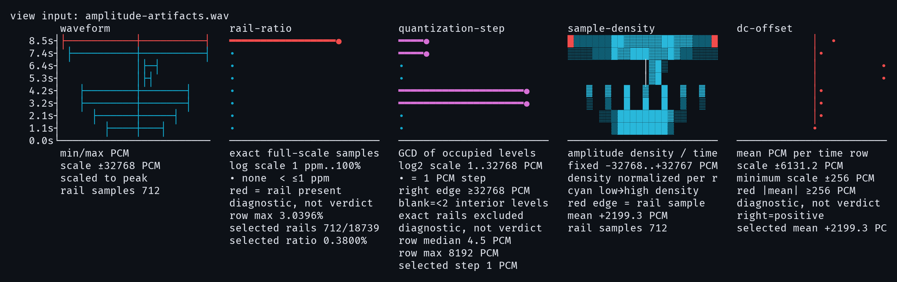

Clipping need not touch the PCM rails or produce exact repeated samples. In this
inspection the upper half is clipped at each half-second block's 45th amplitude
percentile, lightly dithered, and restored to its original RMS. The waveform
peak narrows, `rail-ratio` remains zero, and `flatline-ratio` barely moves;
`peak-occupancy` moves from about 6% to 55% while `crest-factor` falls:

```sh
python3 tools/audio_analysis.py --output json wav inspect \
  build/audio-analysis-docs/subrail-clipping.wav \
  --view waveform --view rail-ratio --view flatline-ratio \
  --view peak-occupancy --view crest-factor --layout columns \
  --view-width 24 --lines-per-second 1 --max-lines 10 \
  --axis first --color always
```

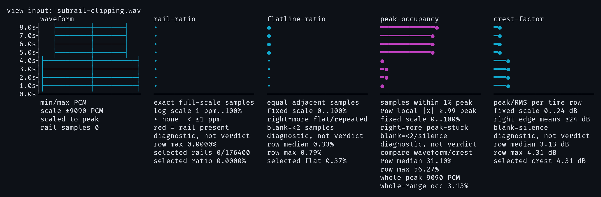

Decoded samples can remain below the signed-PCM rails while idealized
reconstruction crosses full scale between them. The independent
`intersample-peak` view estimates this risk at four phases with a fixed 33-tap
Hann-windowed sinc and plots each time row on a fixed -12..+6 dBFS scale. It is
diagnostic only: it does not change JSON, the click verdict, or exit status, and
it is explicitly not a standards-compliant true-peak meter.

This deterministic fixture repeats `[+1, +1, -1, -1]`. Its first half is at
0.65 full scale, with a -3.74 dBFS sample peak and about -0.73 dBFS estimated
reconstructed peak. Its second half is at 0.75 full scale, with a -2.50 dBFS
sample peak but about +0.51 dBFS reconstructed peak. `rail-ratio` remains zero
throughout, while the upper intersample rows turn red above 0 dBFS:

```sh
python3 tools/audio_analysis.py --output json wav inspect \
  build/audio-analysis-docs/intersample-over.wav \
  --view waveform --view rail-ratio --view intersample-peak \
  --layout columns --view-width 24 --lines-per-second 1 --max-lines 10 \
  --axis first --color always
```

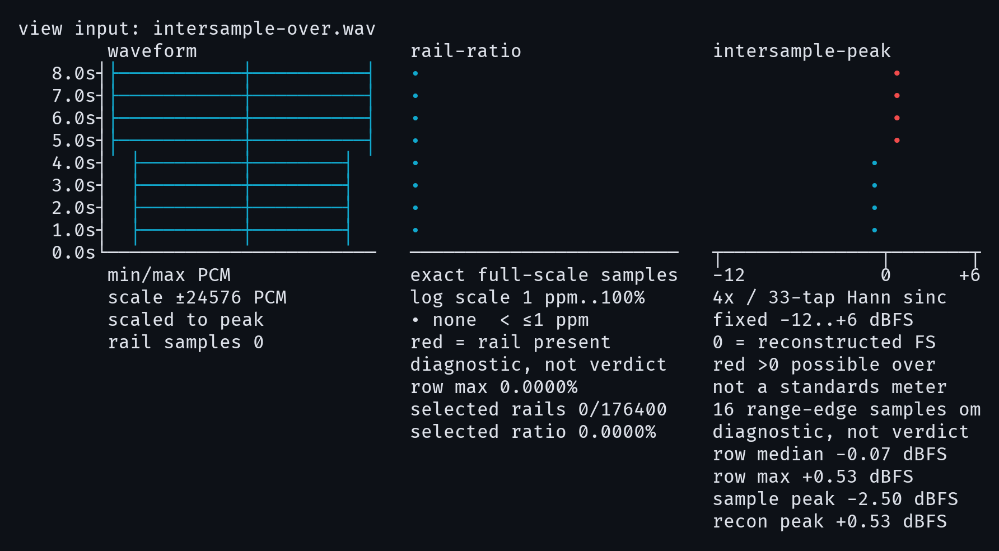

The estimator omits 16 samples at each selected-range edge because a 33-tap
kernel has no complete context there. Display-row boundaries do not introduce
padding: neighboring real samples supply their context. Exact silence and
ranges too short to contain a fully contextualized center sample remain blank.
The dBFS label describes the estimator's numeric reference to 32768 PCM, not a
claim of dBTP certification or conformance to a broadcast metering standard.

For a dynamics-only example, the upper half of this candidate is hard-limited
in half-second blocks and then restored to each block's original RMS. The
`level-delta` trace therefore stays close to zero while the candidate waveform
narrows and its crest-factor bars shorten relative to the reference. The equal
selected-range crest values are dominated by the unchanged half's global peak;
the separated row medians and aligned upper rows expose the local compression:

```sh
python3 tools/audio_analysis.py --output json wav compare \
  build/psg_fidelity/noise-sweep-head.wav \
  build/audio-analysis-docs/rms-matched-compression.wav --labels compressed \
  --view waveform --view level-delta --view crest-factor --layout columns \
  --view-width 20 --lines-per-second 1 --max-lines 10 \
  --axis first --color always
```

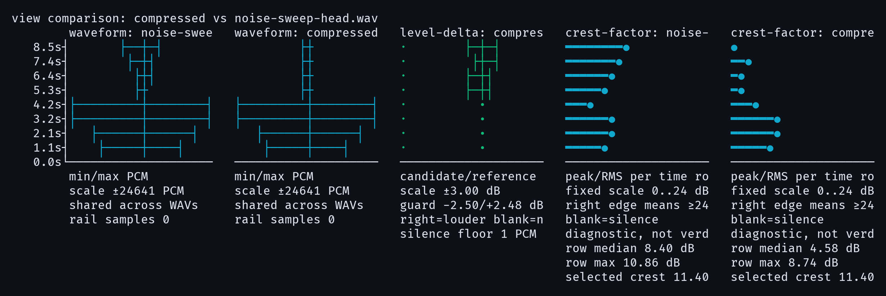

Sustained high-frequency hash can evade an isolated-click interpretation. Here
a 6 kHz component is injected only into the upper half and every half-second
block is restored to its original RMS. `level-delta` remains near zero, the
candidate derivative-ratio moves sharply right of the reference, and the signed
spectral difference localizes the added upper-frequency energy:

```sh
python3 tools/audio_analysis.py --output json wav compare \
  build/audio-analysis-docs/hf-reference.wav \
  build/audio-analysis-docs/hf-hash.wav --labels hf-hash \
  --view level-delta --view derivative-ratio --view spectral-diff \
  --layout columns --view-width 24 --lines-per-second 1 --max-lines 10 \
  --axis first --color always
```

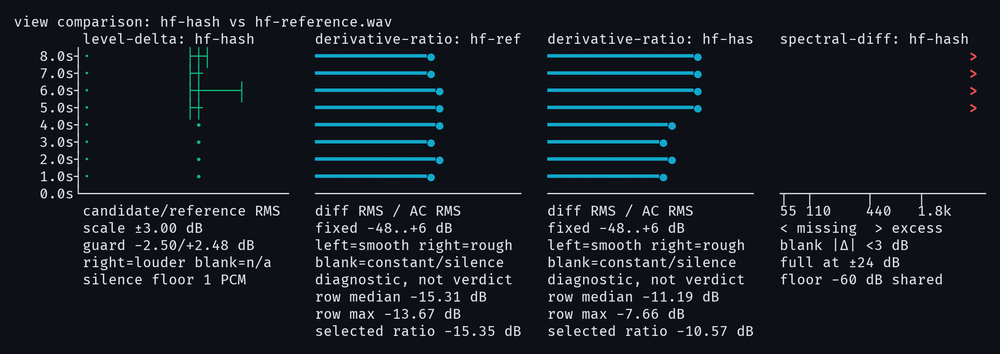

A steady two-tone reference keeps intentional spectral change near zero. Two
RMS-matched one-second replacements preserve the candidate's local level while
substituting an approximately 6 kHz tone. The absolute RMS panels remain
aligned, the candidate `spectral-change` panel exposes the abrupt entry and exit
boundaries, and `spectral-diff` shows that the changed blocks are frequency-local
rather than simple gain errors:

```sh
python3 tools/audio_analysis.py --output json wav compare \
  build/audio-analysis-docs/steady-two-tone.wav \
  build/audio-analysis-docs/spectral-jumps.wav --labels jumps \
  --view rms-level --view spectral-change --view spectral-diff \
  --layout columns --view-width 24 --lines-per-second 1 --max-lines 10 \
  --axis first --color always
```

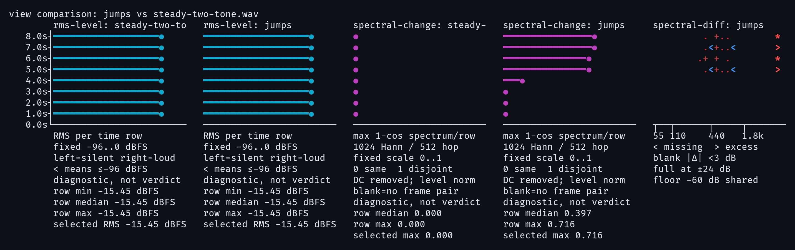

A sustained high-frequency addition is different from a boundary event. Here
the candidate's upper half adds an approximately 6 kHz component while every
half-second block is restored to the reference RMS. The RMS panels remain
identical, the candidate centroid stays rightward for the whole affected half,
and `spectral-diff` identifies the excess upper-band energy:

```sh
python3 tools/audio_analysis.py --output json wav compare \
  build/audio-analysis-docs/steady-two-tone.wav \
  build/audio-analysis-docs/brightened.wav --labels brightened \
  --view rms-level --view spectral-centroid --view spectral-diff \
  --layout columns --view-width 24 --lines-per-second 1 --max-lines 10 \
  --axis first --color always
```

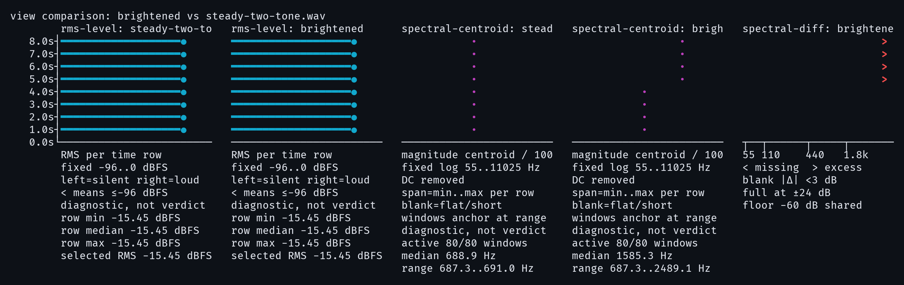

Broadband contamination is not just a brightness shift. Here deterministic
55 Hz–8 kHz noise is added to the upper half of the two-tone reference and each
half-second block is restored to the reference RMS. The level panels therefore
stay aligned while candidate spectral flatness moves right; `spectral-diff`
confirms that the added energy is broadband:

```sh
python3 tools/audio_analysis.py --output json wav compare \
  build/audio-analysis-docs/steady-two-tone.wav \
  build/audio-analysis-docs/noisy-two-tone.wav --labels broadband-noise \
  --view rms-level --view spectral-flatness --view spectral-diff \
  --layout columns --view-width 24 --lines-per-second 1 --max-lines 10 \
  --axis first --color always
```

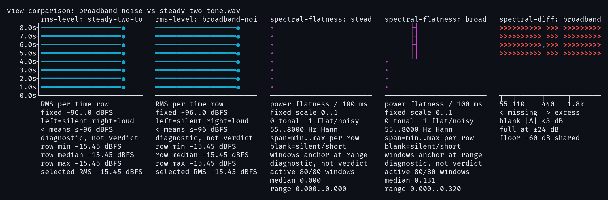

A fixed 1102.5 Hz carrier makes the missing diagnostic dimension clear. Its
first four seconds are unmodulated; its second four seconds have 30% sinusoidal
amplitude modulation at 50 Hz. RMS changes by only about +0.19 dB and remains in
the same terminal cell. Crest factor shows that waveform dynamics changed, and
the carrier spectrogram gains only faint nearby energy, but neither identifies
the rate. The fixed modulation spectrum localizes the strongest FFT bin at
50.113636 Hz with about -11.54 dB measured depth:

```sh
python3 tools/audio_analysis.py --output json wav inspect \
  build/audio-analysis-docs/am-50hz.wav \
  --view rms-level --view crest-factor --view spectrogram \
  --view modulation-spectrum --layout columns --view-width 24 \
  --lines-per-second 1 --max-lines 10 --axis first --color always
```

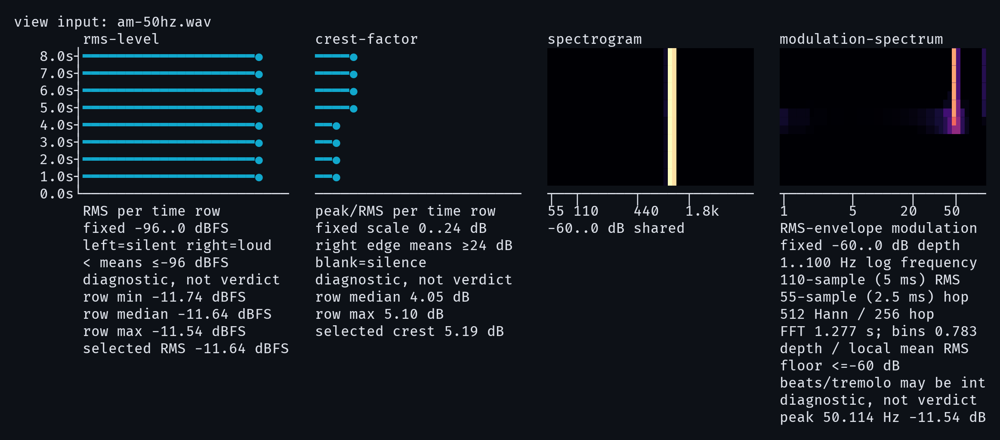

Additive hum is a different mechanism. This fixture keeps an 1102.5 Hz carrier
and +400 PCM low-frequency component at exactly the same RMS, changing only the
hum from 50 Hz to 60 Hz halfway through. `rms-level` is unchanged,
`spectral-change` peaks at only 0.000049, the normal spectrogram collapses both
tones into its first 55–61 Hz band, and envelope modulation shows only a
floor-adjacent -57.76 dB trace for the 50 Hz half rather than locating both
carrier tones. The fixed low-frequency spectrum instead resolves 49.796 and
60.562 Hz in adjacent terminal cells:

```sh
python3 tools/audio_analysis.py --output json wav inspect \
  build/audio-analysis-docs/low-frequency-50-60.wav \
  --view rms-level --view spectral-change --view spectrogram \
  --view modulation-spectrum --view low-frequency-spectrum \
  --layout columns --view-width 24 --lines-per-second 1 --max-lines 10 \
  --axis first --color always
```

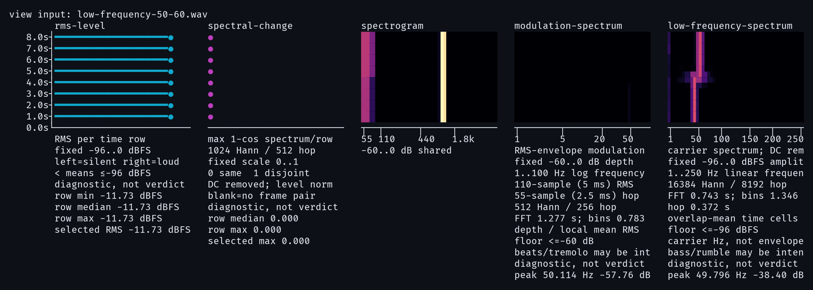

Two exact one-second zeroed buffers make the candidate `rms-level` panel hit its
left edge while the reference remains active. Candidate-only click events mark
the detected hard boundaries and the residual spans stay open for each missing
region, so the composition separates duration from boundary severity without
assuming every transition exceeds the click policy:

```sh
python3 tools/audio_analysis.py --output json wav compare \
  build/audio-analysis-docs/hf-reference.wav \
  build/audio-analysis-docs/dropouts.wav --labels dropouts \
  --view rms-level --view clicks --view residual --layout columns \
  --view-width 24 --lines-per-second 1 --max-lines 10 \
  --axis first --color always
```

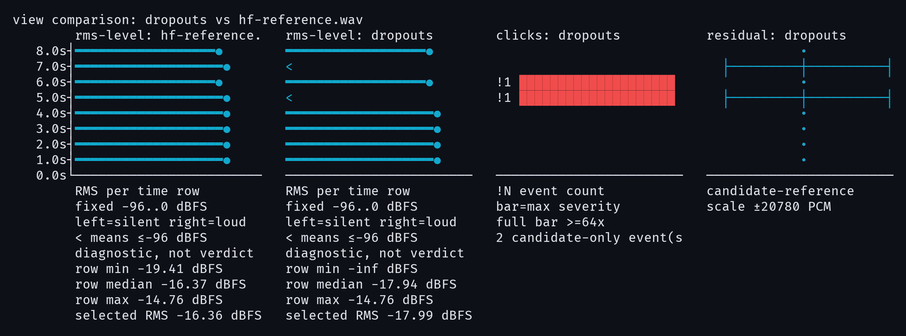

A frozen buffer need not be silent. Here two one-second regions are replaced by
a nonzero constant whose magnitude equals the original block RMS. The candidate
waveform collapses to a point while its `flatline-ratio` reaches 100%; the
reference remains active on the same fixed time rows:

```sh
python3 tools/audio_analysis.py --output json wav compare \
  build/audio-analysis-docs/hf-reference.wav \
  build/audio-analysis-docs/held-buffer.wav --labels held-buffer \
  --view waveform --view flatline-ratio --layout columns \
  --view-width 24 --lines-per-second 1 --max-lines 10 \
  --axis first --color always
```

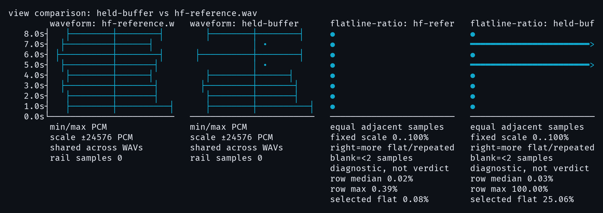

A replayed buffer can remain active and keep its adjacent samples changing, so
neither silence nor `flatline-ratio` is sufficient. Here the candidate's 4–5 s
and 6–7 s blocks are exact replays of their preceding one-second blocks. The
waveform remains active, flatline ratios stay near zero, and `block-repeat`
reaches +1 only on the replayed candidate rows. The one-row-per-second geometry
is part of the diagnostic question rather than an inferred hidden default:

```sh
python3 tools/audio_analysis.py --output json wav compare \
  build/audio-analysis-docs/hf-reference.wav \
  build/audio-analysis-docs/replayed-buffer.wav --labels replayed \
  --view waveform --view flatline-ratio --view block-repeat \
  --layout columns --view-width 24 --lines-per-second 1 --max-lines 10 \
  --axis first --color always
```

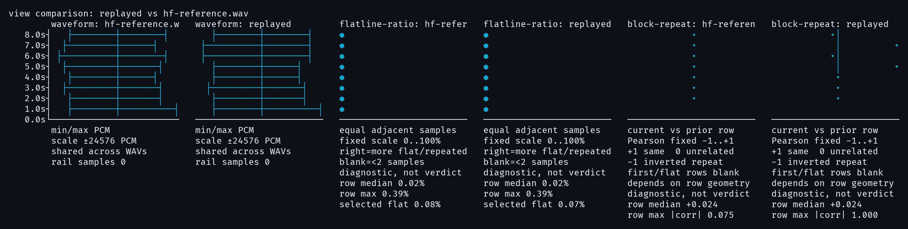

A polarity inversion is deliberately difficult for envelope, level, pitch, and
magnitude-spectrum views: the two waveform envelopes below remain nearly
identical. The fixed signed correlation jumps from +1 at the bottom to -1 after
the halfway inversion, while the residual opens at exactly the same time. The
footer's still-high selected-range correlation is energy-weighted by the louder
unchanged region, demonstrating why the time-local rows must not be replaced by
one aggregate:

```sh
python3 tools/audio_analysis.py --output json wav compare \
  build/psg_fidelity/noise-sweep-head.wav \
  build/audio-analysis-docs/polarity-flip.wav --labels polarity-flip \
  --view waveform --view wave-correlation --view residual --layout columns \
  --view-width 24 --lines-per-second 1 --max-lines 10 \
  --axis first --color always
```

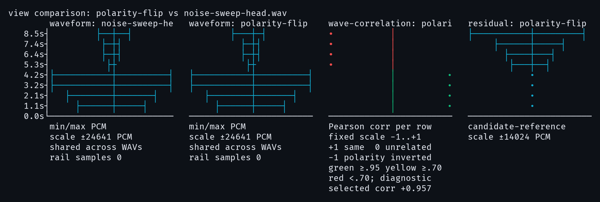

Channel anti-phase is a different failure from a polarity inversion of the
already-mixed signal. Here both files begin with identical left and right
channels. Halfway through the candidate, only the right channel flips: its mono
waveform collapses to silence while `stereo-correlation` moves from +1 to -1.
The reference stays at +1, immediately separating channel cancellation from
ordinary silence:

```sh
python3 tools/audio_analysis.py --output json wav compare \
  build/audio-analysis-docs/stereo-in-phase.wav \
  build/audio-analysis-docs/stereo-phase-flip.wav --labels phase-flip \
  --view waveform --view stereo-correlation --layout columns \
  --view-width 24 --lines-per-second 1 --max-lines 10 \
  --axis first --color always
```

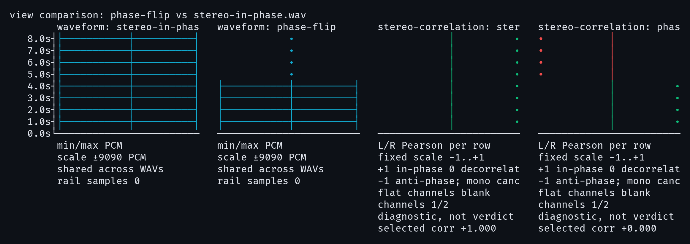

Broadband correlation can still conceal narrow-band cancellation. This stereo
fixture keeps a dominant 344.531 Hz component in phase while moving only a
quieter 2756.250 Hz component to anti-phase after a 100 ms transition. Channel
balance remains 0 dB and `stereo-correlation` remains green near +0.969; the
mono spectrogram nevertheless loses the upper tone. `stereo-phase` names the
cause without needing a separate reference WAV:

```sh
python3 tools/audio_analysis.py --output json wav inspect \
  build/audio-analysis-docs/stereo-frequency-cancellation.wav \
  --view spectrogram --view stereo-balance --view stereo-correlation \
  --view stereo-phase --layout columns --view-width 24 \
  --lines-per-second 1 --max-lines 10 --axis first --color always
```

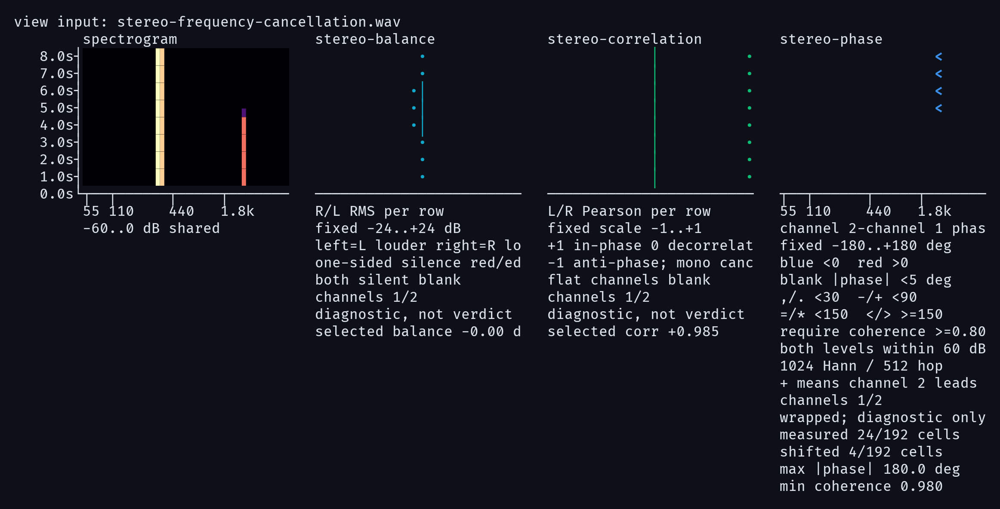

`stereo-phase` applies the same 1024-sample Hann FFT, 512-sample hop, wrapped
-180..+180 degree scale, coherence >=0.80, shared -60 dB power floor, and
5-degree neutral zone as `phase-diff`, but compares decoded channel 2 against
channel 1 within each WAV. Red/positive means channel 2 leads; blue/negative
means it lags. At exactly 180 degrees the sign is a wrapping convention and
either edge means anti-phase. Mono is explicitly not applicable; files with
more than two channels use channels 1 and 2. In comparisons, candidate channels
receive the same global alignment as other candidate views. This remains a
presentation-only diagnostic and does not alter mono analysis, JSON, verdicts,
or exit status.

`stereo-coherence` makes the evidence suppressed by `stereo-phase` explicit.
For every time/log-frequency cell it computes
`abs(sum(X2*conj(X1))) / sqrt(sum(abs(X1)^2)*sum(abs(X2)^2))` across the cell's
1,024-sample Hann STFT coefficients at a 512-sample hop. A stable matching
spectrum at any constant phase approaches 1; changing phase or nonmatching
spectral coefficients approach 0. This normalized complex inner-product
magnitude is deliberately called coherence, not magnitude-squared coherence.
Cells are available only when both channels are within 60 dB of their shared
power peak; weak or one-sided cells remain blank rather than reporting an
arbitrary value.

The glyph scale is fixed and explicit: `X` is below 0.25, `O` below 0.50, `o`
below 0.75, `.` below 0.90, and `·` at least 0.90. Red `X` is diagnostic
salience, not a failure threshold. Deliberate stereo width, reverb, chorus,
independent noise, and ambience can all be low-coherence by design. Mono is
explicitly not applicable; more-than-stereo files use channels 1 and 2. In
comparisons candidate channels receive the same global alignment as every
other channel view. Coherence never changes mono analysis, JSON, quiet output,
verdicts, or exit status.

This fixture keeps channel levels equal and the dominant 344.531 Hz component
coherent. After four seconds only channel 2's quieter 2756.250 Hz tone receives
10 Hz sinusoidal phase modulation with index 2.404826. Global balance remains
within 0.000001 dB and correlation stays green at +0.985; signed channel level
difference is blank. `stereo-phase` is also blank: the first half has neutral
zero phase and the affected half is correctly rejected below its 0.80
coherence requirement. `stereo-coherence` exposes the missing fact directly,
with the upper band falling from 1.0 to roughly 0.001–0.020:

```sh
python3 tools/audio_analysis.py --output json wav inspect \
  build/audio-analysis-docs/stereo-frequency-decorrelation.wav \
  --view stereo-balance --view stereo-correlation \
  --view stereo-level-diff --view stereo-phase --view stereo-coherence \
  --layout columns --view-width 24 --lines-per-second 1 --max-lines 10 \
  --axis first --color always
```

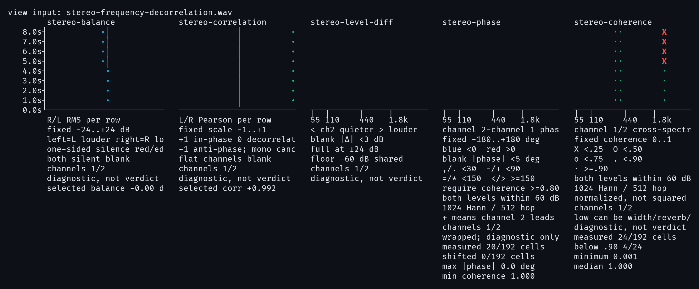

Phase is intentionally unavailable when one channel has no usable energy in a
band, but that absence can itself be a channel-level fault. In this companion
fixture the right channel's 2756.250 Hz component fades out after four seconds
while the dominant 344.531 Hz component remains matched. Global balance changes
by only -0.067 dB, correlation stays green near +0.992, and `stereo-phase`
correctly blanks the lost band. `stereo-level-diff` identifies it as channel 2
being at least 24 dB quieter:

```sh
python3 tools/audio_analysis.py --output json wav inspect \
  build/audio-analysis-docs/stereo-frequency-loss.wav \
  --view spectrogram --view stereo-balance --view stereo-correlation \
  --view stereo-phase --view stereo-level-diff --layout columns \
  --view-width 24 --lines-per-second 1 --max-lines 10 \
  --axis first --color always
```

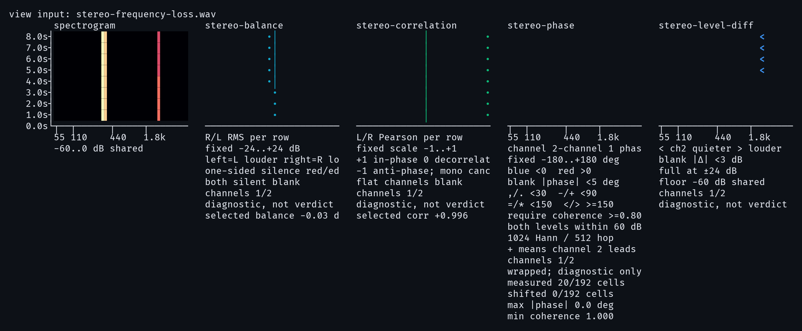

`stereo-level-diff` plots channel-2-minus-channel-1 energy over the same
55..8000 Hz logarithmic frequency grid and time rows as the spectrogram. It uses
1024-sample Hann FFTs at a 512-sample hop and clips both channels to one shared
-60 dB floor before subtraction. Blue `<` means channel 2 is quieter and red
`>` means it is louder; differences below 3 dB are blank and the strongest
glyph begins at 24 dB. A missing channel component therefore reaches the shared
floor instead of producing infinity. Mono is explicitly not applicable, files
with more than two channels use channels 1 and 2, and comparison candidates use
the normal global alignment. The view is diagnostic only and never changes
mono analysis, JSON, verdicts, or exit status.

One-channel loss needs a separate measurement: when a channel becomes flat,
Pearson correlation is undefined and correctly goes blank. In this fixture the
candidate's right channel disappears halfway through. The mono waveform only
shows a generic 6 dB level loss; `stereo-balance` pins to the left edge and says
which channel survived, while `stereo-correlation` blanks in the same rows:

```sh
python3 tools/audio_analysis.py --output json wav compare \
  build/audio-analysis-docs/stereo-in-phase.wav \
  build/audio-analysis-docs/stereo-channel-loss.wav \
  --labels right-channel-loss \
  --view waveform --view stereo-balance --view stereo-correlation \
  --layout columns --view-width 24 --lines-per-second 1 --max-lines 10 \
  --axis first --color always
```

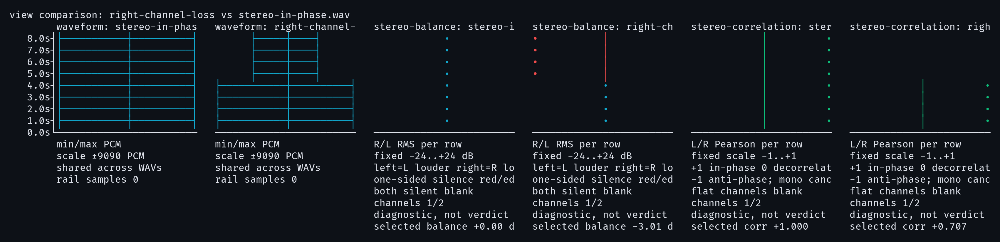

Inter-channel delay is another distinct stereo failure. The candidate below
delays only channel 2 by 44 samples (about 2 ms) halfway through deterministic
broadband audio. The mono `spectral-diff` becomes comb-filtered and zero-lag
correlation drops, but neither identifies the cause. `stereo-delay` remains at
0 ms in the lower half and moves to +2 ms in the upper half. Broadband content
gives one strong correlation peak; a periodic tone would be blank by design:

```sh
python3 tools/audio_analysis.py --output json wav compare \
  build/audio-analysis-docs/stereo-delay-reference.wav \
  build/audio-analysis-docs/stereo-delay-2ms.wav --labels right-2ms-late \
  --view spectral-diff --view stereo-correlation --view stereo-delay \
  --layout columns --view-width 24 --lines-per-second 1 --max-lines 10 \
  --axis first --color always
```

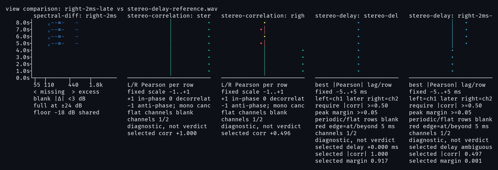

Fixed residual severity matters when the ordinary comparison metrics barely
move. This candidate contains one-second 3 kHz additions at exactly -40 dB and
-20 dB relative to the reference RMS. `level-delta` stays near zero and
waveform correlation stays near +1; `residual-ratio` preserves both calibrated
severities while the auto-scaled residual envelope shows their shape and timing:

```sh
python3 tools/audio_analysis.py --output json wav compare \
  build/audio-analysis-docs/steady-two-tone.wav \
  build/audio-analysis-docs/residual-bursts.wav --labels error-bursts \
  --view level-delta --view wave-correlation --view residual-ratio \
  --view residual --layout columns --view-width 24 \
  --lines-per-second 1 --max-lines 10 --axis first --color always
```

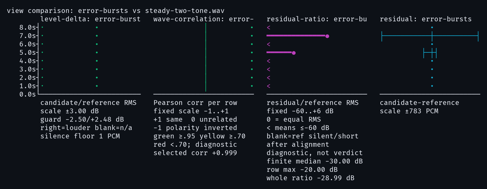

A deliberately mismatched slide/vibrato pair makes signed tuning movement and
frequency-local energy differences obvious:

```sh
python3 tools/audio_analysis.py --output json wav compare \
  build/psg_oracle/clk26500000/reference/effect-1-slide.wav \
  build/psg_oracle/clk26500000/rtl/effect-2-vibrato.wav \
  --labels vibrato-vs-slide \
  --view metrics --view pitch-delta --view spectral-diff --layout columns \
  --view-width 24 --lines-per-second 8 --max-lines 8 \
  --axis first --color always
```

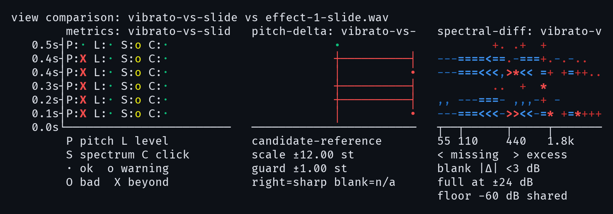

A broken long-track preview makes intermittent gain errors and loss of timing
lock visible at the same timestamps. The range limits presentation to the first
12 seconds; it does not weaken the full-track analysis or verdict:

```sh
python3 tools/audio_analysis.py --output json wav compare \
  build/p8ref/pico8-0.wav build/p8ref/pvfit-0.wav \
  --labels preview-fit \
  --view metrics --view level-delta --view timing-drift --layout columns \
  --view-range 0:12 --view-width 24 --lines-per-second 1 --max-lines 12 \
  --axis first --color always
```

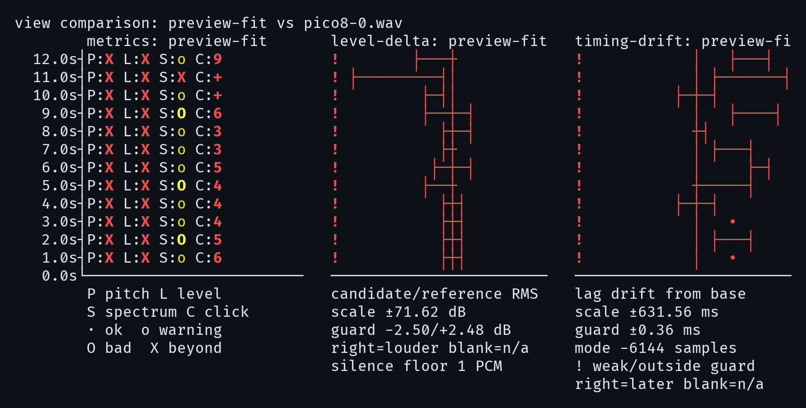

The screenshot source commands and ANSI renderer are kept in
[`render-audio-analysis-screenshots.py`](render-audio-analysis-screenshots.py).
Run it from the repository root after regenerating the referenced build WAVs;
it recreates the documented artifact fixtures and verifies that JSON stdout
still parses before replacing any PNG. Captures are written directly as PNGs;
there is no SVG, browser, or terminal-screenshot intermediate.

The capture raster is deliberately explicit and Retina-safe: Fira Code Retina
and Bold at 32 physical pixels, a 20x40 physical-pixel terminal cell (10x20 at
2x logical density), 32 physical pixels of padding, and 144 DPI metadata. Glyph
origins, baselines, and cell backgrounds use integer coordinates; Fira Code's
box glyphs overlap cell edges so axes stay connected. The renderer requires
`~/Library/Fonts/FiraCode-Retina.ttf` and `FiraCode-Bold.ttf` with the SHA-256
values embedded beside `FONT_REGULAR_SHA256` and `FONT_BOLD_SHA256`; a missing
or different font revision fails explicitly instead of silently producing a
visually different capture. PNG metadata records the font, cell, density, and
direct-render contract for agent inspection.

Terminal geometry defaults are deliberately fixed rather than inferred from
terminal width:

| Option | Default | Contract |
| --- | ---: | --- |
| `--view-width CELLS` | 32 | content width of each panel; valid range 16..110; titles/footer prose clip to fit, while colliding frequency labels are omitted |
| `--lines-per-second N` | 2.0 | requested shared time density; must be positive |
| `--max-lines N` | 120 | scrollback cap; minimum 6 |
| `--layout` | `rows` | `rows` or `columns` |
| `--axis` | `auto` | `each` for rows, `first` for columns; or explicitly `first`, `each`, `none` |
| `--view-range LO:HI` | all audio | seconds applied to every panel and image spectrogram |
| `--color` | `auto` | `always` or `never` makes ANSI behavior deterministic |

The actual row count is `min(max-lines, max(6, round(seconds *
lines-per-second)))`. `--spectrogram` remains a compatibility alias for
`--view spectrogram`; requesting both is a usage error rather than silently
drawing a duplicate. A repeated view is also rejected. Views never change the
analysis or exit status.

Human mode writes reports and views to stdout. JSON and quiet modes keep stdout
unchanged and route requested terminal views to stderr. Thus an agent can parse
the same strict JSON while retaining a visualization in captured diagnostics.
Only `--spectrogram-file` writes state, and it retains its retry-safe replacement
semantics; terminal views are read-only.

## Analyze one cart SFX

The Make target renders the requested SFX and runs the combined row-energy and
stable-note pitch analysis:

```sh
make psg-analyze CART=/path/to/cart.p8.png SFX=8
```

An existing render can be analyzed directly:

```sh
python3 tools/audio_analysis.py sfx analyze build/sfx8.wav \
  --cart /path/to/cart.p8.png --sfx 8
```

Every row reports its requested note, waveform, volume and effect beside RMS,
peak level, and measured pitch. Energy and `click-v1` artifacts are checked. A pitch verdict
is withheld for noise, custom instruments, slides, vibrato, drops, and
arpeggios: those sounds do not have one stable requested fundamental, so calling
them pitch failures would be a false result.

Use `--silent-below RMS` to calibrate the energy floor and
`--pitch-tolerance SEMITONES` to override the default half-semitone stable-note
guard.

## Agent-facing command contract

The discoverable noun-verb tree is `wav inspect`, `wav compare`, and
`sfx analyze`. The retired flat `compare` and `sfx` spellings have been removed;
they fail as usage errors instead of relying on ambiguous argument rewriting.

Every result command accepts `--output human|json` and `--quiet`/`-q`. These
flags may precede the noun or follow the verb, but the output mode must be
specified exactly once; repeated or conflicting flags are usage errors rather
than last-option-wins overrides. JSON mode writes exactly one strict JSON object
plus a newline to stdout. Quiet mode writes only `ok`,
`failed`, or `error`, one value per result. Human mode writes its report to
stdout. In JSON/quiet mode, requested terminal views, warnings, and
diagnostics go to stderr, so structured stdout can be parsed without filtering.

All top-level result objects carry `schema_version`, `command`, and `status`.
Status is `ok`, `failed` for a completed analysis outside tolerance, `error`
when no requested analysis could be performed, or `partial` for a comparison
batch containing both completed and errored candidates. Numeric durations use
seconds or explicitly named millisecond fields; frequencies use hertz.

The checked machine contract is
[`schemas/audio-analysis-v2.schema.json`](schemas/audio-analysis-v2.schema.json).
Tests validate inspect, comparison, mixed/error batch, SFX, and command-error
payloads against it without requiring an optional runtime package.

Structured errors use this stable shape:

```json
{"schema_version":2,"command":"wav.inspect","status":"error","error":"input_not_found","message":"audio input does not exist: missing.wav","retryable":false,"field":"wav","value":"missing.wav","suggestion":"check the path or render the WAV before retrying"}
```

Exit codes are stable across the command tree:

| Code | Meaning |
| ---: | --- |
| 0 | success; every applicable analysis passed |
| 1 | measured failure, mixed batch failure, or general operation failure |
| 2 | invalid arguments, malformed/unsupported audio, cart, range, or labels |
| 3 | input resource not found |
| 4 | permission denied |
| 130 | interrupted by Ctrl-C |
| 141 | stdout consumer closed the pipe |

### `wav inspect`

- **Inputs and validation:** one path or `-` for stdin; 8- or 16-bit PCM at
  22,050 Hz. Multiple channels are mixed to mono for every analysis and result;
  decoded originals are retained as in-process presentation context and are
  consumed only by `stereo-balance`, `stereo-level-diff`,
  `stereo-correlation`, `stereo-delay`, `stereo-phase`, and
  `stereo-coherence`.
- **Side effects and retry:** read-only unless `--spectrogram-file PATH` is
  supplied. That explicit artifact is replaced on retry; no prompt occurs.
- **Human output:** duration, peak, RMS, click policy/result/timestamps, and any
  requested independent/composed terminal views.
- **JSON schema:** `audio` contains path, label, sample rate, sample count,
  duration, peak, RMS, and the SHA-256 of the exact source bytes. `clicks`
  contains the complete `click-v1` policy, counts, truncation state, severity,
  and timestamped events; `spectrogram_file` is a string or null.
- **Verdict and quiet output:** any click fails with exit 1 and
  `failure_types: ["clicks"]`; quiet emits one `ok` or `failed` line.
- **Dry-run/confirmation:** not applicable; the command is non-interactive and
  its only write is the explicitly named, retry-safe artifact.

```sh
python3 tools/audio_analysis.py --output json wav inspect render.wav
python3 tools/audio_analysis.py -q wav inspect render.wav
```

### `wav compare`

- **Inputs and validation:** one reference plus one or more candidates. At most
  one path may be `-`. `--labels` must provide exactly one non-empty label per
  candidate. `--profile` defaults to `full-track-v2`; there is no environment-
  dependent or TTY-dependent policy selection.
- **Side effects and retry:** analysis is read-only. `--spectrogram-file`
  replaces the named file; with several candidates, a stable input ordinal and
  sanitized label are inserted into each output name, so repeated labels cannot
  overwrite one another.
- **Human output:** reference/candidate summaries, the full metric report, and
  requested independent/composed terminal views.
- **JSON schema:** `reference`, a `candidates` collection with one `ok`,
  `failed`, or `error` result per input candidate, and aggregate `summary`
  counts. A completed candidate includes alignment, pitch, level, spectrum,
  band, contour, lock, click comparison, score, complete versioned policy,
  failure fields, and input SHA-256. The reference carries its own SHA-256.
- **Verdict:** branch on candidate `status`, not `score`. `failure_types` names
  the independent gates which failed, and `policy` records every threshold.
- **Quiet output:** one status line per candidate in input order.
- **Batch exit:** 1 when a measured failure or mixed completed/error batch
  occurs. A resource-specific code is retained only when every candidate has
  that same error (for example, 3 when every candidate is absent).
- **Dry-run/confirmation:** not applicable; there are no implicit writes or
  prompts.

```sh
python3 tools/audio_analysis.py --output json wav compare \
  reference.wav hardware.wav preview.wav --labels hardware,preview
```

### `sfx analyze`

- **Inputs and validation:** one WAV path or stdin, an existing PICO-8
  `.p8.png`, and an SFX index in 0..63. Thresholds must be non-negative.
- **Side effects and retry:** read-only, idempotent, and non-interactive.
- **Human output:** WAV/click summary, 32 annotated rows, and aggregate failures.
- **JSON schema:** audio/cart identity, SFX timing/loop/filter fields, every row
  with requested and measured properties, click analysis, summary counts, and
  SHA-256 values for both WAV and cart.
- **Quiet output:** one `ok` or `failed` line.
- **Dry-run/confirmation/batch:** not applicable; it performs one read-only
  analysis and never prompts.

```sh
python3 tools/audio_analysis.py --output json sfx analyze render.wav \
  --cart game.p8.png --sfx 8
```

## Library API

Tools in `tools/` can import `audio_analysis` directly. The intended reusable
surface is:

- Input, identity, and summaries: `load_audio` returns `LoadedAudio` with exact
  source SHA-256; `load_wav` remains the samples-only convenience API;
  `load_pcm16_mono` is the non-coercing boundary for byte-exact gates;
  `sha256_bytes`, `sha256_file`, `describe_wav`, and `display_name`.
- Scalar/window metrics: `rms`, `spectral_centroid`, `repeat_rate`,
  `high_frequency_power_share`, `windowed_spectral_centroids`, `pitch`, and
  `semitone_distance`.
- Sparse discontinuities: pure `analyze_clicks` returns `ClickAnalysis`;
  `compare_clicks` matches events on a shared timebase; `report_click_analysis`
  renders standalone findings. `click_policy` resolves the versioned detector.
- Synchronized render pitch gate: `pitch_agreement` and
  `report_pitch_agreement`.
- Full reference comparison: pure `analyze_comparison` returns one
  `ComparisonResult`; `report_comparison` handles human output and an optional
  `AudioView`, whose `views` tuple selects composable terminal panels and whose
  `path` retains the image-spectrogram behavior. `SpectrogramView` is retained
  as a compatibility alias for older callers. `comparison_policy` resolves a
  versioned profile. The `compare_audio` score-returning reporting wrapper
  exists only for compatibility.
  Lower-level alignment, contour, lock, band-balance, and STFT helpers remain
  available to specialized fidelity baselines.
- Cart-aware inspection: `analyze_sfx` and `report_sfx_analysis`.

All repository analysis is calibrated for mono 22,050 Hz audio. `load_wav`
accepts 8- or 16-bit PCM, normalizes both to signed 16-bit amplitude units, and
mixes multiple channels to mono, but rejects a different sample rate by default.
`load_audio` additionally retains the decoded original channels solely as
presentation context for `stereo-balance`, `stereo-level-diff`,
`stereo-correlation`, `stereo-delay`, `stereo-phase`, and `stereo-coherence`;
it does not add channel fields to JSON or change any analysis input.
That rejection is intentional: accepting it
would silently put pitch and frequency bands on the wrong scale.

Example integration:

```python
import audio_analysis as audio

reference = audio.load_audio(reference_path)
candidate = audio.load_audio(candidate_path)
result = audio.analyze_comparison(
    reference.samples,
    candidate.samples,
    "candidate",
    policy="full-track-v2",
)
view = audio.AudioView(
    views=("level-delta", "timing-drift", "contour", "band-delta"),
    layout="columns", width=24,
    color=False, path="build/comparison.png",
)
audio.report_comparison(result, view=view)
if not result.passed:
    raise SystemExit(1)
```

Use a stricter domain-specific gate when the property is not a general audio
comparison. `psg_oracle.py` and `psg_binary_model.py` retain their exact and
statistical comparison semantics, but both consume the shared non-coercing
`load_pcm16_mono` input boundary. Domain verdicts remain separate; WAV decoding
does not.

## Tests

Run the focused regression suite with:

```sh
python3 tools/test_audio_analysis.py
```

`make test-psg` includes this suite before the RTL testbench.
The suite synthesizes its WAV fixtures in temporary directories, including
smooth tones, square/pulse/saw false-positive guards, isolated impulses, and
phase resets, so it does not depend on ignored `build/` artifacts from a
developer checkout.
